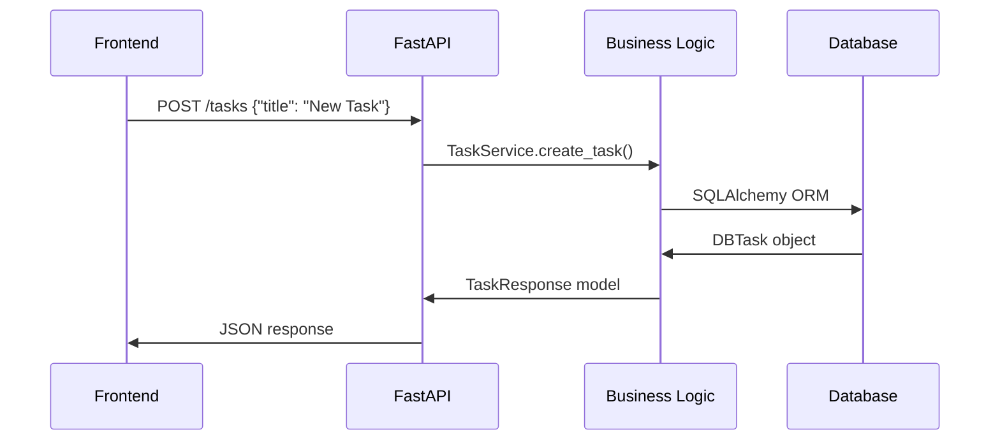

# Architecture Guide

This document provides a comprehensive overview of One Job's architecture, design patterns, and technical decisions.

## 🏛️ High-Level Architecture

One Job follows a **three-tier architecture** with clear separation of concerns:

```
┌─────────────────────────────────────────────────────────┐
│                     Frontend Layer                      │
│   ┌─────────────┐  ┌─────────────┐  ┌─────────────┐    │
│   │  React UI   │  │   Hooks     │  │  API Client │    │
│   │ Components  │  │  & State    │  │             │    │
│   └─────────────┘  └─────────────┘  └─────────────┘    │
└────────────────────────┬────────────────────────────────┘
                         │ HTTP/REST API
┌────────────────────────▼────────────────────────────────┐
│                     Backend Layer                       │
│   ┌─────────────┐  ┌─────────────┐  ┌─────────────┐    │
│   │   FastAPI   │  │  Business   │  │ Data Access │    │
│   │  Endpoints  │  │    Logic    │  │    Layer    │    │
│   └─────────────┘  └─────────────┘  └─────────────┘    │
└────────────────────────┬────────────────────────────────┘
                         │ SQLAlchemy ORM
┌────────────────────────▼────────────────────────────────┐
│                   Persistence Layer                     │
│   ┌─────────────┐  ┌─────────────┐  ┌─────────────┐    │
│   │   SQLite    │  │ PostgreSQL  │  │   Future    │    │
│   │    (dev)    │  │   (prod)    │  │ Databases   │    │
│   └─────────────┘  └─────────────┘  └─────────────┘    │
└─────────────────────────────────────────────────────────┘
```

## 🎯 Domain-Driven Design

The application is organized around **core business domains**:

### Core Domains

#### 1. **Task Management Domain**
```
Task Aggregate Root
├── Task Entity (id, title, description, status, timestamps)
├── Task Status (todo, done)
├── Task Operations (create, complete, defer, update)
└── Task Ordering (sort_order, deferral logic)
```

#### 2. **Substack Domain** 
```
Substack Aggregate Root
├── Substack Entity (id, name, parent_task_id)
├── SubstackTask Entities (tasks within substacks)
├── Hierarchical Operations (create, navigate, manage)
└── Parent-Child Relationships
```

#### 3. **Integration Domain** (Future)
```
Integration Services
├── External System Adapters (Linear, Jira, etc.)
├── Import/Export Operations
├── Data Transformation
└── Sync Management
```

### Bounded Contexts

| Context | Responsibility | Key Models |
|---------|----------------|------------|
| **Task Management** | Core task CRUD operations | Task, TaskStatus |
| **Organization** | Hierarchical task structure | Substack, SubstackTask |
| **User Interface** | Presentation and interaction | TaskCard, TaskStack |
| **Persistence** | Data storage and retrieval | DBTask, DBSubstack |
| **Integration** | External system connectivity | ImportService, ExportService |

## 🗄️ Data Layer Architecture

### Database Schema

```sql
-- Core tasks table
CREATE TABLE tasks (
    id UUID PRIMARY KEY,
    title VARCHAR NOT NULL,
    description TEXT,
    completed BOOLEAN DEFAULT FALSE,
    status VARCHAR DEFAULT 'todo', -- 'todo' | 'done'
    created_at TIMESTAMP WITH TIME ZONE,
    completed_at TIMESTAMP WITH TIME ZONE,
    deferred_at TIMESTAMP WITH TIME ZONE,
    deferral_count INTEGER DEFAULT 0,
    sort_order INTEGER,
    external_id VARCHAR,
    source VARCHAR
);

-- Substacks for hierarchical organization
CREATE TABLE substacks (
    id UUID PRIMARY KEY,
    name VARCHAR NOT NULL,
    parent_task_id UUID REFERENCES tasks(id),
    created_at TIMESTAMP WITH TIME ZONE
);

-- Tasks within substacks
CREATE TABLE substack_tasks (
    id UUID PRIMARY KEY,
    title VARCHAR NOT NULL,
    description TEXT,
    completed BOOLEAN DEFAULT FALSE,
    substack_id UUID REFERENCES substacks(id),
    created_at TIMESTAMP WITH TIME ZONE,
    completed_at TIMESTAMP WITH TIME ZONE,
    sort_order INTEGER DEFAULT 0
);
```

### Data Access Patterns

#### Repository Pattern
```python
# Abstract repository interface
class TaskRepository(ABC):
    @abstractmethod
    async def create(self, task: TaskCreate) -> Task: ...
    
    @abstractmethod
    async def get_all(self) -> List[Task]: ...
    
    @abstractmethod 
    async def update(self, task_id: UUID, updates: TaskUpdate) -> Task: ...

# SQLAlchemy implementation
class SQLTaskRepository(TaskRepository):
    def __init__(self, session: Session):
        self.session = session
    
    async def create(self, task: TaskCreate) -> Task:
        db_task = DBTask(**task.dict())
        self.session.add(db_task)
        self.session.commit()
        return Task.from_orm(db_task)
```

#### Unit of Work Pattern
```python
class UnitOfWork:
    def __init__(self, session_factory):
        self.session_factory = session_factory
    
    def __enter__(self):
        self.session = self.session_factory()
        return self
    
    def __exit__(self, *args):
        self.session.rollback()
        self.session.close()
    
    def commit(self):
        self.session.commit()
```

## 🔄 API Layer Architecture

### RESTful Design Principles

The API follows REST conventions with clear resource hierarchies:

```
/tasks                          # Task collection
├── POST /tasks                 # Create task
├── GET /tasks                  # List all tasks  
├── PUT /tasks/{id}             # Update task
└── /tasks/{id}/substacks       # Substack collection
    ├── POST /tasks/{id}/substacks        # Create substack
    └── /substacks/{id}/tasks             # Substack tasks
        ├── POST /substacks/{id}/tasks    # Add task to substack
        └── PUT /substack-tasks/{id}      # Update substack task
```

### Request/Response Flow



### Error Handling Strategy

```python
# Custom exception hierarchy
class OneJobError(Exception): ...

class ValidationError(OneJobError): ...
class NotFoundError(OneJobError): ...
class BusinessLogicError(OneJobError): ...

# Global exception handlers
@app.exception_handler(ValidationError)
async def validation_exception_handler(request, exc):
    return JSONResponse(
        status_code=400,
        content={"error": "validation_error", "detail": str(exc)}
    )
```

## 🎨 Frontend Architecture

### Component Hierarchy

```
App.tsx
├── Router
│   └── Index.tsx (Main Page)
│       ├── TaskStack.tsx (Card Interface)
│       │   └── TaskCard.tsx (Individual Cards)
│       ├── CompletedTasks.tsx (Completed View)
│       ├── TaskIntegration.tsx (Import/Export)
│       └── TaskDetails.tsx (Detail Modal)
│           └── SubstackCreator.tsx (Substack Management)
└── SubstackView.tsx (Nested Task View)
```

### State Management Architecture

```typescript
// Global state patterns
interface AppState {
  tasks: Task[]
  selectedTask: Task | null
  currentSubstack: SubstackContext | null
  loading: boolean
  error: string | null
}

// Custom hooks for business logic
const useTaskManagement = () => {
  const [tasks, setTasks] = useState<Task[]>([])
  
  const refreshTasks = useCallback(async () => {
    const response = await fetch('/api/tasks')
    const data = await response.json()
    setTasks(data.map(mapBackendTaskToFrontendTask))
  }, [])
  
  return { tasks, refreshTasks }
}
```

### Component Design Patterns

#### Compound Components
```typescript
// TaskStack compound pattern
const TaskStack = ({ tasks, onComplete, onDefer }) => {
  return (
    <TaskStack.Container>
      {tasks.map(task => (
        <TaskStack.Card 
          key={task.id} 
          task={task}
          onSwipeRight={onComplete}
          onSwipeLeft={onDefer}
        />
      ))}
    </TaskStack.Container>
  )
}
```

#### Render Props Pattern
```typescript
// Gesture handling abstraction
const SwipeHandler = ({ children, onSwipeLeft, onSwipeRight }) => {
  const handlers = useSwipeable({
    onSwipedLeft: onSwipeLeft,
    onSwipedRight: onSwipeRight,
  })
  
  return <div {...handlers}>{children}</div>
}
```

## 🔄 Business Logic Patterns

### Service Layer
```python
class TaskService:
    def __init__(self, task_repo: TaskRepository):
        self.task_repo = task_repo
    
    async def create_task(self, task_data: TaskCreate) -> TaskResponse:
        # Business rules
        max_order = await self.task_repo.get_max_sort_order()
        task_data.sort_order = (max_order or 0) + 1
        
        # Persistence
        task = await self.task_repo.create(task_data)
        return TaskResponse.from_domain(task)
    
    async def defer_task(self, task_id: UUID) -> TaskResponse:
        # Complex business logic for deferral
        task = await self.task_repo.get_by_id(task_id)
        if task.status != "todo":
            raise BusinessLogicError("Cannot defer non-todo task")
        
        # Move to end of queue
        await self._move_task_to_end(task)
        task.deferred_at = datetime.now()
        task.deferral_count += 1
        
        return await self.task_repo.update(task)
```

### Domain Events (Future Enhancement)
```python
from dataclasses import dataclass
from datetime import datetime

@dataclass
class TaskCompleted:
    task_id: UUID
    completed_at: datetime
    user_id: UUID

@dataclass  
class TaskDeferred:
    task_id: UUID
    deferred_at: datetime
    deferral_count: int

# Event handlers
class TaskEventHandler:
    async def handle_task_completed(self, event: TaskCompleted):
        # Analytics, notifications, etc.
        pass
```

## 🧪 Testing Architecture

### Testing Pyramid

```
                    ┌─────────────────┐
                    │   E2E Tests     │ <- Browser automation
                    │   (Playwright)  │
                    └─────────────────┘
                   ┌─────────────────────┐
                   │  Integration Tests  │ <- API + DB tests
                   │     (pytest)        │
                   └─────────────────────┘
                 ┌───────────────────────────┐
                 │     Unit Tests            │ <- Component/function tests
                 │  (pytest + React Testing) │
                 └───────────────────────────┘
```

### Test Strategies

#### Backend Testing
```python
# Domain logic tests
def test_task_deferral_updates_sort_order():
    task = Task(id=uuid4(), title="Test", sort_order=1)
    service = TaskService(MockRepository())
    
    result = await service.defer_task(task.id)
    
    assert result.sort_order > 1
    assert result.deferred_at is not None

# Integration tests
def test_complete_workflow(test_client):
    # Create task
    response = test_client.post("/tasks", json={"title": "Test"})
    task_id = response.json()["id"]
    
    # Create substack
    response = test_client.post(f"/tasks/{task_id}/substacks", 
                               json={"name": "Sub"})
    
    # Verify hierarchy
    response = test_client.get("/tasks")
    tasks = response.json()
    assert len(tasks[0]["substacks"]) == 1
```

#### Frontend Testing
```typescript
// Component tests
test('TaskCard swipe gestures work correctly', () => {
  const onComplete = jest.fn()
  const onDefer = jest.fn()
  
  render(<TaskCard task={mockTask} onSwipeRight={onComplete} onSwipeLeft={onDefer} />)
  
  fireEvent.swipeRight(screen.getByTestId('task-card'))
  expect(onComplete).toHaveBeenCalledWith(mockTask.id)
})

// Integration tests
test('Task creation workflow', async () => {
  render(<App />)
  
  fireEvent.change(screen.getByRole('textbox'), { target: { value: 'New Task' } })
  fireEvent.click(screen.getByRole('button', { name: /add task/i }))
  
  await waitFor(() => {
    expect(screen.getByText('New Task')).toBeInTheDocument()
  })
})
```

## 🚀 Performance Considerations

### Frontend Optimizations
- **React.memo()** for component memoization
- **useMemo()** for expensive calculations
- **useCallback()** for stable function references
- **Code splitting** with React.lazy()
- **Virtual scrolling** for large task lists (future)

### Backend Optimizations
- **Database indexing** on frequently queried columns
- **Connection pooling** for database connections
- **Async/await** patterns for non-blocking operations
- **Query optimization** with SQLAlchemy
- **Caching** with Redis (future enhancement)

### Mobile Performance
- **Touch-optimized gestures** with react-use-gesture
- **Smooth animations** at 60fps with Framer Motion
- **Responsive images** and asset optimization
- **Service Worker** for offline capabilities (future)

## 🔒 Security Architecture

### Current Security Measures
- **Input validation** with Pydantic
- **SQL injection prevention** via SQLAlchemy ORM
- **CORS configuration** for cross-origin requests
- **Data sanitization** in API endpoints

### Future Security Enhancements
```python
# Authentication & Authorization
class AuthService:
    async def authenticate_user(self, token: str) -> User:
        # JWT validation, user lookup
        pass
    
    async def authorize_task_access(self, user: User, task_id: UUID) -> bool:
        # Check task ownership/sharing permissions
        pass

# Security middleware
@app.middleware("http")
async def security_middleware(request: Request, call_next):
    # Rate limiting, security headers, etc.
    response = await call_next(request)
    response.headers["X-Content-Type-Options"] = "nosniff"
    return response
```

## 🔄 Integration Architecture

### External System Integration
```python
# Adapter pattern for external systems
class ExternalTaskAdapter(ABC):
    @abstractmethod
    async def import_tasks(self) -> List[ExternalTask]: ...
    
    @abstractmethod
    async def export_task(self, task: Task) -> bool: ...

class LinearAdapter(ExternalTaskAdapter):
    def __init__(self, api_key: str):
        self.client = LinearClient(api_key)
    
    async def import_tasks(self) -> List[ExternalTask]:
        issues = await self.client.get_issues()
        return [self._map_issue_to_task(issue) for issue in issues]

class JiraAdapter(ExternalTaskAdapter):
    # Jira-specific implementation
    pass
```

### Event-Driven Architecture (Future)
```python
# Message bus for decoupled communication
class MessageBus:
    def __init__(self):
        self.handlers = defaultdict(list)
    
    def register_handler(self, event_type: Type, handler: Callable):
        self.handlers[event_type].append(handler)
    
    async def publish(self, event: DomainEvent):
        for handler in self.handlers[type(event)]:
            await handler(event)
```

## 🎛️ Configuration Management

### Environment-Based Configuration
```python
class Settings(BaseSettings):
    # Database
    DATABASE_URL: str
    
    # API
    API_HOST: str = "127.0.0.1"
    API_PORT: int = 8000
    
    # External integrations
    LINEAR_API_KEY: Optional[str] = None
    JIRA_API_KEY: Optional[str] = None
    
    # Feature flags
    ENABLE_INTEGRATIONS: bool = False
    ENABLE_ANALYTICS: bool = False
    
    class Config:
        env_file = ".env"
```

## 📈 Monitoring & Observability (Future)

### Metrics Collection
```python
# Custom metrics
from prometheus_client import Counter, Histogram, Gauge

TASK_OPERATIONS = Counter('task_operations_total', 'Total task operations', ['operation'])
REQUEST_DURATION = Histogram('request_duration_seconds', 'Request duration')
ACTIVE_TASKS = Gauge('active_tasks_total', 'Number of active tasks')

# Usage
@REQUEST_DURATION.time()
async def create_task(task_data: TaskCreate):
    TASK_OPERATIONS.labels(operation='create').inc()
    # ... business logic
```

### Logging Strategy
```python
import structlog

logger = structlog.get_logger()

async def defer_task(task_id: UUID):
    logger.info("Task deferral initiated", task_id=str(task_id))
    try:
        result = await task_service.defer_task(task_id)
        logger.info("Task deferred successfully", 
                   task_id=str(task_id), 
                   new_sort_order=result.sort_order)
        return result
    except Exception as e:
        logger.error("Task deferral failed", 
                    task_id=str(task_id), 
                    error=str(e))
        raise
```

---

This architecture provides a solid foundation for the current MVP while maintaining flexibility for future enhancements like multi-user support, advanced integrations, and scale-out scenarios.